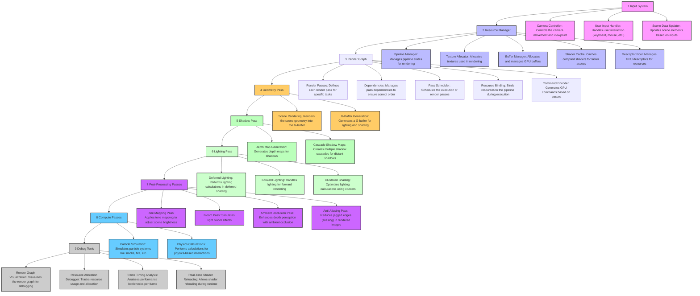

<a id="readme-top"></a>
<!-- PROJECT SHIELDS -->
[![Contributors][contributors-shield]][contributors-url]
[![Forks][forks-shield]][forks-url]
[![Stargazers][stars-shield]][stars-url]
[![Issues][issues-shield]][issues-url]
[![MIT License][license-shield]][license-url]

<!-- PROJECT LOGO -->
<br />
<div align="center">
  <a href="https://github.com/khudiiash/webgpu-renderer">
    
  </a>

  <h3 align="center">Khudiiash's WebGPU Renderer</h3>

  <p align="center">
    An awesome WebGPU renderer !
    <br />
    <a href="https://mebyz.github.io/webgpu-renderer-demo">View Demo</a>
    ·
    <a href="https://github.com/khudiiash/webgpu-renderer/issues/new?labels=bug&template=bug-report---.md">Report Bug</a>
    ·
    <a href="https://github.com/khudiiash/webgpu-renderer/issues/new?labels=enhancement&template=feature-request---.md">Request Feature</a>
  </p>
</div>


<!-- TABLE OF CONTENTS -->
<!--
<details>
  <summary>Table of Contents</summary>
  <ol>
    <li>
      <a href="#about-the-project">About The Project</a>
      <ul>
        <li><a href="#built-with">Built With</a></li>
      </ul>
    </li>
    <li>
      <a href="#getting-started">Getting Started</a>
    </li>
    <li><a href="#usage">Usage</a></li>
    <li><a href="#architecture">Proposed Architecture</a></li>
    <li><a href="#roadmap">Roadmap</a></li>
    <li><a href="#contributing">Contributing</a></li>
    <li><a href="#license">License</a></li>
    <li><a href="#contact">Contact</a></li>
    <li><a href="#acknowledgments">Acknowledgments</a></li>
  </ol>
</details>
-->

<!-- ABOUT THE PROJECT -->
## About The Project

### A WebGPU 3D renderer for web. 

### For a few years, we were stuck developing games on WebGL, and now WebGPU seems to be a breath of fresh air ! 

https://github.com/user-attachments/assets/e652ba67-bbc2-480b-92f7-59c617efb217


https://github.com/user-attachments/assets/cd47b4c9-a43d-40f5-bc6b-f2a841afc4dc


https://github.com/user-attachments/assets/83fedd2b-f73f-430f-9275-4a937da58410


https://github.com/user-attachments/assets/0cd42e44-60ef-4440-8bd4-def7ede117dc

### Key features:

* ShaderLib for composing shaders from chunks
* Buffers management
* Directional Light
* Fog
* PCF Shadows
* Phong Material
* GLTFLoader
* Instancing
* Wind Shader
* Boids

"I am excited about how well it performs on both PC and mobile hitting 60 FPS on my iPhone 13 without a sweat" - Khudiiash


<!-- GETTING STARTED -->
## Getting Started

1. Clone the repo
   ```sh
   git clone https://github.com/khudiiash/webgpu-renderer.git
   ```
2. Install NPM packages
   ```sh
   yarn
   ```
3. Build
   ```js
   yarn build
   ```
4. Run
   ```sh
   yarn run
   ```
   
<!-- ARCHITECTURE -->
## Proposed Architecture



1. Input System: Handles user input and updates the scene based on the user's interactions.

2. Resource Manager: Manages GPU resources such as textures, buffers, and shaders to ensure efficient usage.

3. Render Graph: Coordinates different rendering passes and manages resource dependencies to optimize performance.

4. Geometry Pass: Renders the scene’s geometry and generates the G-buffer for deferred rendering.

5. Shadow Pass: Calculates the shadow maps to provide realistic lighting effects in the scene.

6. Lighting Pass: Applies various lighting techniques to the scene, including deferred and forward lighting.

7. Post-Processing Passes: Applies final visual effects such as tone mapping, bloom, and anti-aliasing.

8. Compute Passes: Runs compute shaders for simulations such as particle effects and physics calculations.

9. Debug Tools: Provides visualization and debugging tools for monitoring and optimizing the renderer.

<!-- ROADMAP -->
## Roadmap

- [x] Add Readme
- [x] Add License
- [ ] V2
- [ ] Global Illumination

See the [open issues](https://github.com/khudiiash/webgpu-renderer/issues) for a full list of proposed features (and known issues).


<!-- CONTRIBUTING -->
## Contributing

Contributions are what make the open source community such an amazing place to learn, inspire, and create. Any contributions you make are **greatly appreciated**.

If you have a suggestion that would make this better, please fork the repo and create a pull request. You can also simply open an issue with the tag "enhancement".
Don't forget to give the project a star! Thanks again!

1. Fork the Project
2. Create your Feature Branch (`git checkout -b feature/AmazingFeature`)
3. Commit your Changes (`git commit -m 'Add some AmazingFeature'`)
4. Push to the Branch (`git push origin feature/AmazingFeature`)
5. Open a Pull Request

### Top contributors:

<a href="https://github.com/khudiiash/webgpu-renderer/graphs/contributors">
  
</a>


<!-- LICENSE -->
## License

Distributed under the MIT License. See `LICENSE` for more information.


<!-- CONTACT -->
## Contact

khudiiash - u/mitrey144 on reddit - [https://github.com/khudiiash](https://github.com/khudiiash)

mebyz - u/mebyz on reddit - [https://github.com/mebyz](https://github.com/mebyz)


<!-- ACKNOWLEDGMENTS -->
## Acknowledgments

* [WebGPU](https://www.w3.org/TR/webgpu/)


<!-- MARKDOWN LINKS & IMAGES -->
<!-- https://www.markdownguide.org/basic-syntax/#reference-style-links -->
[contributors-shield]: https://img.shields.io/github/contributors/khudiiash/webgpu-renderer.svg?style=for-the-badge
[contributors-url]: https://github.com/khudiiash/webgpu-renderer/graphs/contributors
[forks-shield]: https://img.shields.io/github/forks/khudiiash/webgpu-renderer.svg?style=for-the-badge
[forks-url]: https://github.com/khudiiash/webgpu-renderer/network/members
[stars-shield]: https://img.shields.io/github/stars/khudiiash/webgpu-renderer.svg?style=for-the-badge
[stars-url]: https://github.com/khudiiash/webgpu-renderer/stargazers
[issues-shield]: https://img.shields.io/github/issues/khudiiash/webgpu-renderer.svg?style=for-the-badge
[issues-url]: https://github.com/khudiiash/webgpu-renderer/issues
[license-shield]: https://img.shields.io/github/license/khudiiash/webgpu-renderer.svg?style=for-the-badge
[license-url]: https://github.com/khudiiash/webgpu-renderer/blob/master/LICENSE

